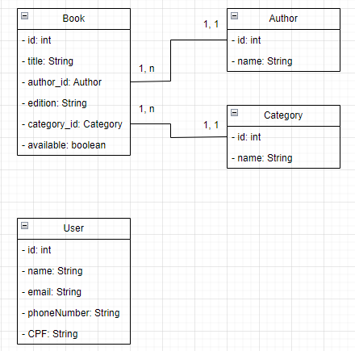

## Sistema Gerenciamento de uma Biblioteca

Criar um sistema Spring Boot para gerenciamento de uma biblioteca.

### Features:

#### 1. Cadastro de livros

Permitir o cadastro de novos livros.

- id: int
- titulo: String
- autor: String
- edicao: String
- categoria: String || Categoria
- disponivel: boolean

---

#### 2. Visualizacao de livros

Permitir a visualização do acervo de livros.

- todos
- por autor
- por categoria

---

#### 3. Remocao de livros

Permitir a remoção de livros do acervo.

---

#### 4. Cadastro de categorias

Permitir o cadastro de categorias.

- id: int
- nome: String

---

#### 5. Visualizacao de categorias

Permitir a visualização de categorias.

#### 6. Remover categorias

Permitir a remoção de categorias.

#### 7. Cadastro de usuários

Permitir cadastro de usuários.

- id: int
- nome: String
- email: String
- telefone: String
- CPF: String

#### 8. Visualizacao dos usuários

Permitir a visualização dos usuários.

#### 9. Remocao de usuário

Permitir a remoção de usuário.

#### 10. Emprestar um livro

Implementar a funcionalidade de emprestar um livro para um usuário.

#### 11. Devolver um livro

Implementar a funcionalidade de devolução de um livro por um usuário.

---

### Trechos de código para copiar

#### Configuração do Maven Resources Plugin

```xml
<plugin>
	<groupId>org.apache.maven.plugins</groupId>
	<artifactId>maven-resources-plugin</artifactId>
	<version>3.1.0</version>
</plugin>
```

#### Configurações do banco de dados

```
# Changing path url to access Spring Boot Application
server.servlet.context-path = /library-management

# Setup information to H2 Database
spring.datasource.url=jdbc:h2:mem:testdb
spring.datasource.username=sa
spring.datasource.password=

# Setup WEB client to H2 Database
spring.h2.console.enabled=true
spring.h2.console.path=/h2-console

# Setup to show SQL in the console
spring.jpa.show-sql=true
spring.jpa.properties.hibernate.format_sql=true
```

#### Script SQL

```sql
### Inserting books of the Robert Cecil...
INSERT INTO tb_author(name) VALUES ('Robert Cecil Martin');
INSERT INTO tb_category(name) VALUES('Informatics');
INSERT INTO tb_book(title,author_id,edition,category_id,available) VALUES('Clean Code',1,'Illustrated',1,true);
INSERT INTO tb_book(title,author_id,edition,category_id,available) VALUES('Clean Architecture',1,'Illustrated',1,true);

### Inserting books of the Robert Cecil...
INSERT INTO tb_author(name) VALUES ('William Gibson');
INSERT INTO tb_category(name) VALUES('Adventure and Science Fiction');
INSERT INTO tb_book(title,author_id,edition,category_id,available) VALUES('Neuromancer',2,'Illustrated',2,true);
INSERT INTO tb_book(title,author_id,edition,category_id,available) VALUES('Periféricos',2,'Illustrated',2,true);

### Inserting users...
INSERT INTO tb_user(name, email, phone_number, CPF) VALUES ('Guilherme', 'guilhermedecarvalhomachado@gmail.com', '+55(99)99999-9999');
INSERT INTO tb_user(name, email, phone_number, CPF) VALUES ('Maria Carolina', 'guilhermedecarvalhomachado@gmail.com', '+55(99)99999-9999');
```
#### ORM
